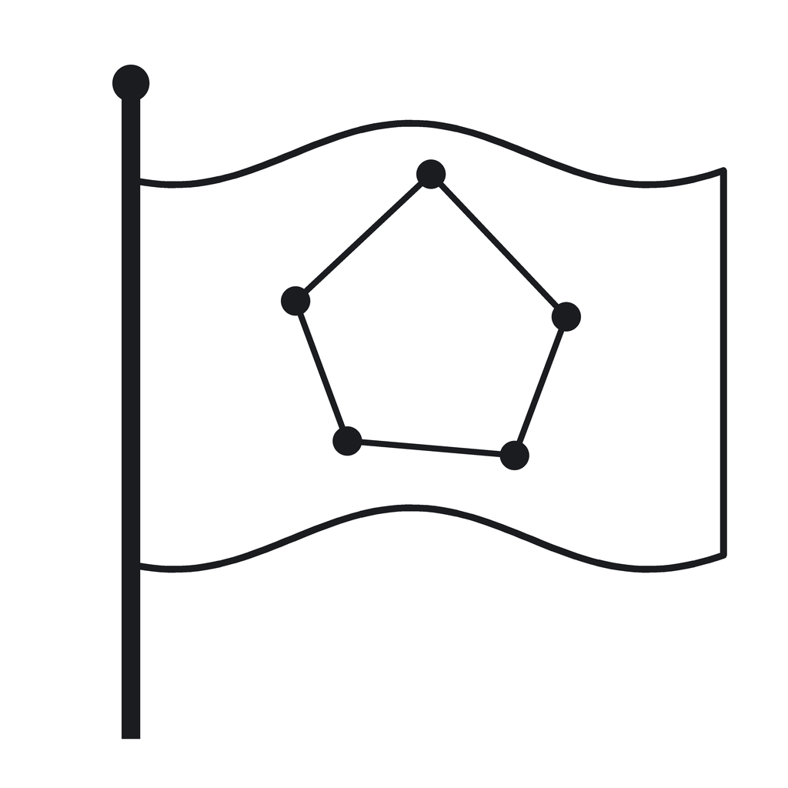

<p align="center">
  
</p>

# Local flag algebras: pentagon densities and strong edge-colouring — accompanying code

This repository contains the code accompanying two papers:

- **Paper 1.** E. Davey, E. Hurley, R. de Joannis de Verclos, R. J. Kang, J. Volec.
  *Local flag algebras.* [arXiv:2607.12461](https://arxiv.org/abs/2607.12461), 2026.
- **Paper 2.** E. Davey, E. Hurley, R. de Joannis de Verclos, R. J. Kang, J. Volec.
  *Strong edge-colouring via local flag algebras.* [arXiv:2607.17421](https://arxiv.org/abs/2607.17421), 2026.

It has three parts:

1. a **Lean 4 formalisation** (`DaveyThesis2024/`) that machine-verifies the papers' main
   theorems, including the semidefinite-programming (SDP) certificates;
2. a **Rust certificate generator** (`local-flags-certificates/`, built on `rust-flag-algebra`)
   that produces the SDP certificates the formalisation consumes; and
3. **exhaustive-search scripts** (`local-flags-certificates/{pentagon_search,sec_search}/`,
   Python + [nauty](https://pallini.di.uniroma1.it/)) backing the empirical and extremal claims.

The work partially originates in E. Davey's MSc thesis *Local Flag Algebras* (University of Amsterdam, 2024).

## Main results (Lean)

| Paper result | Lean name | Statement | Beyond-standard axioms |
|---|---|---|---|
| Paper 1, Thm 1.1 | `pentagon_bound_simple` | P(G) ≤ \|G\|·Δ⁴/40, G triangle-free | none |
| Paper 1, Thm 1.2 | `pentagon_bound_full` | P(G) ≤ 0.02073·\|G\|·Δ⁴, G triangle-free | 2 (pentagon-Q bridge) |
| Paper 1, Lem 1.4 | `clebsch_blowup_tight` | Clebsch blow-ups attain ratio 12/625 at every Δ=5k | none |
| Paper 1, Δ=5 | `pentagon_delta5_tight`, `pentagon_delta5_extremal_iff` | per-vertex bound + Clebsch extremal characterisation | none |
| Paper 1, Δ=3 | `pentagon_bound_delta3`, `pentagon_delta3_extremal_iff` | P(G) ≤ 6·\|G\|/5 (Δ≤3), Petersen unique extremal | none |
| Paper 1, Δ=4 | `pentagon_bound_delta4`, `pentagon_delta4_witness`, `pentagonCountAt_le_24_tight` | P(G) ≤ 24·\|G\|/5 (Δ≤4); C₁₂(2,3) attains ratio 1/64; per-vertex bound tight | none |
| Paper 2, Thm 1.1 | `strong_chromatic_index_bound[_thesis_tight]` | χ'ₛ(G) ≤ 1.74·Δ² (tight form 1.73·Δ²) | 4 (Hurley + 3 SEC cert) |
| Paper 2, Thm 1.2 | `strong_chromatic_index_bipartite[_thesis_tight]` | χ'ₛ(G) ≤ 1.63·Δ² bipartite (tight 1.6255·Δ²) | 4 |
| Paper 2, Thm 1.3 | `strong_chromatic_index_asymmetric_bipartite[_thesis_tight]` | χ'ₛ(G) ≤ 1.6633·Δ_A·Δ_B (per-p form 1.6632·p·Δ²) | 4 (Hurley + 3 SEC cert) |
| Paper 2, Thm 1.4 | `secRandomBipartite_aas` | Brualdi–Quinn Massey holds a.a.s. for G(n_A,n_B,p) | 2 (verbatim Kim–Vu / Pippenger–Spencer) |
| Paper 2, Prop 8.1(a) | `omega_lineGraphSq_le_mul_bipartite` | ω(L(G)²) ≤ Δ_A·Δ_B, bipartite | none |
| Paper 2, Prop 8.1(b) | `edges_le_nu_s_mul_mul_bipartite` | ν_s(G) ≥ \|E(G)\|/(Δ_A·Δ_B), bipartite | none |

See **[`RESULTS.md`](RESULTS.md)** for the full side-by-side correspondence: every
result above with its exact Lean statement, the user-defined definitions it rests
on, and every user-defined axiom (with the mathematical statement each encodes).

`DaveyThesis2024/AxiomCheck.lean` is the authoritative, build-enforced (`#guard_msgs`) record of
the exact axiom set of every headline. Beyond the standard Lean kernel axioms (`propext`,
`Classical.choice`, `Quot.sound`, and `Lean.ofReduceBool`/`Lean.trustCompiler` for the
`native_decide` certificates), the named domain assumptions are the SDP cert upper bounds and
bridge identities (each carrying a Statement / Why-needed / Why-correct docstring and gated by a
regularity hypothesis matching the certificate's degree-regularity constraint), plus the
sparse-colouring lemma of Hurley–de Joannis de Verclos–Kang (2022). Paper 2's SEC assumptions are
the F-faithful (`_F`) certificate axioms (see [`RESULTS.md`](RESULTS.md) §5). The
project is **sorry-free**.

## Repository layout

```
DaveyThesis2024/            Lean 4 formalisation
├── Basic, FlagIso, LocalFlagAlgebra, Extensions, CG22   core flag-algebra framework
├── Pentagon*               Thms 1.1/1.2, Δ=3/4/5 per-degree bounds + extremal graphs (Petersen, C₁₂(2,3), Clebsch)
├── PentagonQCertificate/   auto-generated size-8 SDP cert (278 native_decide blocks)
├── StrongEdgeColouring, StrongChromaticIndex, Sec*       SEC headlines, F-faithful SDP bridges, WLOG-biregular reduction
├── Sec{,Bipartite}Certificate/, AsymSecCertificate/   auto-generated SEC cert blocks (general / bipartite / asymmetric CG4)
├── SECRandomBipartite, SecRandomBipartite/              Brualdi–Quinn Massey a.a.s.
└── AxiomCheck.lean         build-enforced axiom-hygiene guards
local-flags-certificates/   Rust SDP-certificate generator + search scripts
├── src/, examples/         cert generators (built on rust-flag-algebra)
├── rust-flag-algebra/      vendored flag-algebra library (GPL-3.0; see Licence)
├── emit_lean_cert.py       converts a solved cert into PentagonQCertificate/ Lean source
├── pentagon_search/        extremal pentagon-density search (+ House of Graphs cross-check)
└── sec_search/             Erdős–Nešetřil / Faudree counterexample sweeps
```

## Building the Lean formalisation

Toolchain is pinned in `lean-toolchain` (`leanprover/lean4:v4.28.0`); Mathlib is pinned in
`lake-manifest.json`. Install [`elan`](https://github.com/leanprover/elan), then:

```bash
lake exe cache get     # fetch the prebuilt Mathlib cache
lake build             # builds + verifies everything, including AxiomCheck
```

The certificate blocks are large machine-generated Lean (≈300 MB of source); a full build
compiles them in parallel and may take a while on first run. `lake build DaveyThesis2024.AxiomCheck`
re-checks the headline axiom sets.

## Tooling and methodology

Beyond the Lean 4 / Mathlib / Lake toolchain above, the Lean development was carried
out with **[Claude Code](https://claude.com/claude-code)**, Anthropic's agentic
command-line coding tool, running **Claude Opus** models. It was used throughout for:

- **proof construction** — drafting proofs of the framework lemmas, the per-vertex
  counting arguments, and the extremal characterisations;
- **`sorry`-filling** — closing proof obligations incrementally (convert a hard step
  or a candidate axiom to `sorry`, then fill it);
- **compiler-guided repair** — iterating against Lean's error output to mend proofs;
- **golfing** — shrinking tactic scripts without changing what is proved;
- **axiom elimination** — turning several domain axioms into proved theorems
  (the surviving axiom set is pinned in `AxiomCheck.lean`);
- **orchestration** — multi-file audits, axiom-hygiene checks, and the
  extremal-graph searches were run as parallel Claude Code subagents.

The two papers carry a matching AI-usage declaration noting which results were
obtained by first constructing the proof this way. The supporting pipelines — the
CSDP / SDPA-LR semidefinite solvers and the Rust certificate generator (feeding the
`native_decide` certificate blocks via `emit_lean_cert.py`), and nauty for the
exhaustive searches — are described in the two sections below; [`RESULTS.md`](RESULTS.md)
maps each theorem to its Lean statement and exact axiom set.

## Building and running the Rust certificate generator

```bash
cd local-flags-certificates
cargo build --release
```

System dependencies: a Rust toolchain ([`rustup`](https://rustup.rs/)), the **CSDP** solver
(the `csdp` CLI — `apt install coinor-csdp`, or `brew install csdp`), and **gfortran + cmake**
(for the CSDP/LAPACK link). `rust-flag-algebra/` is **vendored** as a path dependency — there is
no submodule to initialise.

Generate certificates with the example binaries:

```bash
cargo run --release --example bounded_pentagon                  # pentagon density
cargo run --release --example bounded_pentagon_alt_approach     # Paper 1 Thm 1.2 size-8 cert
cargo run --release --example bruhn_joos                        # Paper 1 §8 Bruhn–Joos sparsity 3/2
cargo run --release --example strong_edge_colouring             # Paper 2 Thm 1.1
cargo run --release --example bipartite_strong_edge_colouring   # Paper 2 Thm 1.2
cargo run --release --example asymmetric_bipartite_strong_density  # Paper 2 Thm 1.3
```

On first run the flag-algebra library computes and caches lists of graphs and flag-operator
matrices under `local-flags-certificates/data/` (gitignored; can grow to ~1.4 GB — delete it to
reclaim space, it is regenerated on demand). `emit_lean_cert.py` rationalises a solved certificate
and emits the Lean source under `DaveyThesis2024/PentagonQCertificate/`.

## Running the exhaustive searches

```bash
pip install -r requirements.txt
```

These also need **nauty** (`geng`, `genbg`, `genbgL`) on the `PATH`. The C helper is shipped as
source: `cc -O2 local-flags-certificates/sec_search/fast_check.c -o fast_check`.

- `pentagon_search/` — `phase0_known_graphs.py` … `phase4_broad_search.py` search for
  triangle-free graphs maximising the pentagon density; `hog/` cross-checks against the
  House of Graphs database; `delta5_tight/` covers the Δ=5 extremal analysis.
- `sec_search/` — `sweep.py` and the `run_*.sh` drivers sweep for counterexamples to the
  Erdős–Nešetřil and Faudree(-asymmetric) conjectures; `verify_sec_cert.py` re-checks a cert.
  See `sec_search/README.md` and `sec_search/sec_counterexample_results.md`.

## Citing

```bibtex
@misc{daveyPentagonLocalFlags2026,
  title  = {Local Flag Algebras},
  author = {Davey, Eoin and Hurley, Eoin and de Joannis de Verclos, R\'emi
            and Kang, Ross J. and Volec, Jan},
  year   = {2026},
  eprint = {2607.12461},
  archivePrefix = {arXiv},
  primaryClass = {math.CO}
}

@misc{daveySECLocalFlags2026,
  title  = {Strong Edge-Colouring via Local Flag Algebras},
  author = {Davey, Eoin and Hurley, Eoin and de Joannis de Verclos, R\'emi
            and Kang, Ross J. and Volec, Jan},
  year   = {2026},
  eprint = {2607.17421},
  archivePrefix = {arXiv},
  primaryClass = {math.CO}
}
```

## Licence

This repository is released under the **Apache License 2.0** (see [`LICENSE`](LICENSE)), with one
exception: the vendored `local-flags-certificates/rust-flag-algebra/` directory is the
`rust-flag-algebra` library by Rémi de Joannis de Verclos and remains under its own **GPL-3.0**
licence (see `local-flags-certificates/rust-flag-algebra/LICENSE`). Builds that link against it
are subject to the GPL-3.0.
